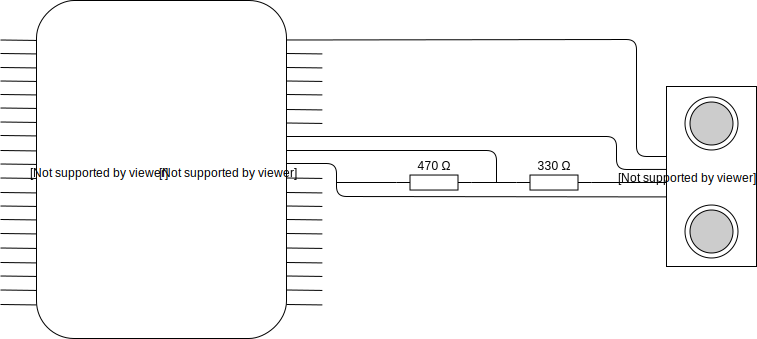

# Raspberry Pi Demos

After completing the Hello World and getting the LED to light up in various colors the next step is to get familiar
with differnt electrical components.

## Ultrasonic Sensor

A [Ultrasonic Sensor](https://www.modmypi.com/blog/hc-sr04-ultrasonic-range-sensor-on-the-raspberry-pi) is a sensor that
sends out ultrasonic waves and detects as they bounce of of obsticles in order for the sensor to measure the distance to the
object.

### Electronic Diagram



### Code

```python
#Libraries
import RPi.GPIO as GPIO
import time
 
#GPIO Mode (BOARD / BCM)
GPIO.setmode(GPIO.BCM)
 
#set GPIO Pins
GPIO_TRIGGER = 23
GPIO_ECHO = 24
 
#set GPIO direction (IN / OUT)
GPIO.setup(GPIO_TRIGGER, GPIO.OUT)
GPIO.setup(GPIO_ECHO, GPIO.IN)
 
def distance():
    # set Trigger to HIGH
    GPIO.output(GPIO_TRIGGER, True)
 
    # set Trigger after 0.01ms to LOW
    time.sleep(0.00001)
    GPIO.output(GPIO_TRIGGER, False)
 
    StartTime = time.time()
    StopTime = time.time()
 
    # save StartTime
    while GPIO.input(GPIO_ECHO) == 0:
        StartTime = time.time()
 
    # save time of arrival
    while GPIO.input(GPIO_ECHO) == 1:
        StopTime = time.time()
 
    # time difference between start and arrival
    TimeElapsed = StopTime - StartTime
    # multiply with the sonic speed (34300 cm/s)
    # and divide by 2, because there and back
    distance = (TimeElapsed * 34300) / 2
 
    return distance
 
if __name__ == '__main__':
    try:
        while True:
            dist = distance()
            print ("Measured Distance = %.1f cm" % dist)
            time.sleep(1)
 
        # Reset by pressing CTRL + C
    except KeyboardInterrupt:
        print("Measurement stopped by User")
        GPIO.cleanup()
```
*Code from [tutorials-raspberrypi.com](https://tutorials-raspberrypi.com/raspberry-pi-ultrasonic-sensor-hc-sr04/)*

### Resources
* https://tutorials-raspberrypi.com/raspberry-pi-ultrasonic-sensor-hc-sr04/
* https://www.modmypi.com/blog/hc-sr04-ultrasonic-range-sensor-on-the-raspberry-pi

## Servo Control

A servo is a component that allows the angle of the rotating axis to be set to a precise angle. Unlike a motor, it doesn't continuously rotate.

### Electronic Diagram

### Code

```python
import RPi.GPIO as GPIO
from time import sleep

SERVO_GPIO = 23

GPIO.setmode(GPIO.BCM)
GPIO.setup(SERVO_GPIO, GPIO.OUT)

servo = GPIO.PWM(SERVO_GPIO, 50)
servo.start(0)

def setAngle(angle):
    if angle >= 0 and angle <= 180:
        duty = (angle / 18.0) + 2.5
        servo.ChangeDutyCycle(duty)

try:
    while True:
        angle = float(input("Enter Angle (0 - 180): "))
        setAngle(angle)
            
except KeyboardInterrupt:
    print("CTRL-C: Terminating program.")
finally:
    print("Cleaning up GPIO...")
    servo.stop()
    GPIO.cleanup()
```
### Resources
* http://rpi.science.uoit.ca/lab/servo/
* http://www.instructables.com/id/Servo-Motor-Control-With-Raspberry-Pi/
