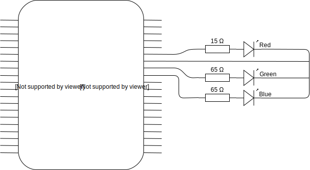
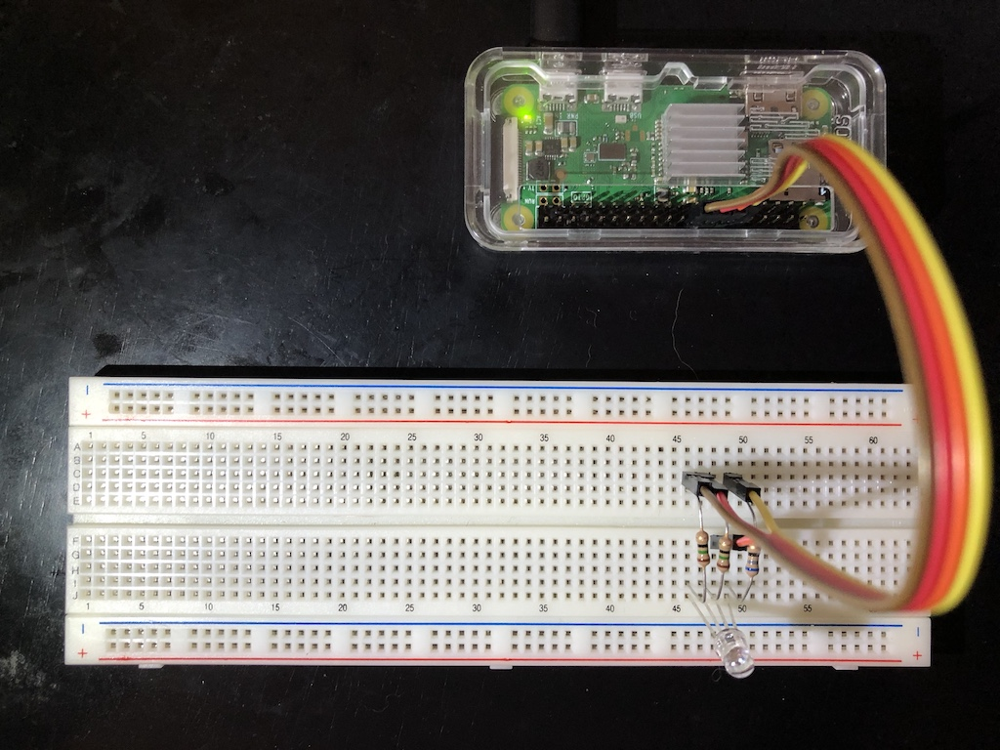

# Raspberry Pi Hello World

Now that the Raspberry Pi is [ready and booted up](raspberry_pi_setup.md) the next step is to start controlling something.
The simplest would be a single LED but instead these instructions will skip to an [RGB LED](https://smile.amazon.com/gp/product/B01C19ENDM).

## Basic LED Diagram


When hooking up the LED to the Raspberry Pi, the GPIO pins will be used and will act as the power source when pulled high (turned on).

The resistor is connected into the circuit to control the current that flows from the Pi to the LED.

The LED (Light Emitting Diode) is as its name says a diode which allows current to flow in one direction only, so if the plus and minus are connected the wrong way, the LED won't light up.

A RGB LED is essentially three LEDs in a single package and as such has three connectros, one for each color and a shared ground.


Each of the colors will need a resistor.


In order to choose the right resistor, the specs for the LED need to be known, meaning the forward voltage and forward current are needed. The [RGB LED](https://smile.amazon.com/gp/product/B01C19ENDM) used in the example here has the specs:

| Color    | Forward Voltage    | Forward Current     |
|----------|--------------------|---------------------|
| Red      | 2 V                | 20 mA               |
| Green    | 3 V                | 20 mA               |
| Blue     | 3 V                | 20 mA               |

The Raspberry Pi GPIO pins, which are the source for the LED, have a voltage of 3.3 V. Taking this data, the formula to compute the needed resitor is as followed.


Using the formula, the resistors values can be calculated. To find the right resistor, use the [resistor color calculator](http://www.resistorguide.com/resistor-color-code-calculator/). The exact resistor might not be readily available in which case picking the nearest larger resistor will still work. For example, if the result of the calculation asks for a 65 Ω resistor, a 68 Ω resistor will do if that's what is available.

| Color   | Resistor   | Resistor Color Code   |
|---------|------------|-----------------------|
| Red     | 65 Ω       |    |
| Green   | 15 Ω       |    |
| Blue    | 15 Ω       |    |

## Connecting it All

Putting it all together, the following diagram shows the RGB LED connected to GPIO 18, 23 and 24 respectively.



## Controlling the LED

### Using the `gpio` Utility

Power up the Raspberry Pi and open a `ssh` connection to the Pi. The simplest way to control the GPIOs is using the `gpio` command.

First set the GPIO mode of the used pins to output (write). The default of the GPIOs is input (read).

```
gpio -g mode 18 out
gpio -g mode 23 out
gpio -g mode 24 out
```

The pins are ready to be written to.

```
gpio -g write 18 1 # turn on red
gpio -g write 18 0 # turn off red
gpio -g write 23 1 # turn on green
gpio -g write 23 0 # turn off green
gpio -g write 24 1 # turn on blue
gpio -g write 18 1 # turn on red (turns LED purple)
```

Check the status of the pins.

```
gpio readall
```

This will print the status of all pins of the Raspberry Pi.

```
 +-----+-----+---------+------+---+-Pi ZeroW-+---+------+---------+-----+-----+
 | BCM | wPi |   Name  | Mode | V | Physical | V | Mode | Name    | wPi | BCM |
 +-----+-----+---------+------+---+----++----+---+------+---------+-----+-----+
 |     |     |    3.3v |      |   |  1 || 2  |   |      | 5v      |     |     |
 |   2 |   8 |   SDA.1 |   IN | 1 |  3 || 4  |   |      | 5v      |     |     |
 |   3 |   9 |   SCL.1 |   IN | 1 |  5 || 6  |   |      | 0v      |     |     |
 |   4 |   7 | GPIO. 7 |   IN | 1 |  7 || 8  | 0 | IN   | TxD     | 15  | 14  |
 |     |     |      0v |      |   |  9 || 10 | 1 | IN   | RxD     | 16  | 15  |
 |  17 |   0 | GPIO. 0 |   IN | 0 | 11 || 12 | 1 | OUT  | GPIO. 1 | 1   | 18  |
 |  27 |   2 | GPIO. 2 |   IN | 0 | 13 || 14 |   |      | 0v      |     |     |
 |  22 |   3 | GPIO. 3 |   IN | 0 | 15 || 16 | 0 | OUT  | GPIO. 4 | 4   | 23  |
 |     |     |    3.3v |      |   | 17 || 18 | 1 | OUT  | GPIO. 5 | 5   | 24  |
 |  10 |  12 |    MOSI |   IN | 0 | 19 || 20 |   |      | 0v      |     |     |
 |   9 |  13 |    MISO |   IN | 0 | 21 || 22 | 0 | IN   | GPIO. 6 | 6   | 25  |
 |  11 |  14 |    SCLK |   IN | 0 | 23 || 24 | 1 | IN   | CE0     | 10  | 8   |
 |     |     |      0v |      |   | 25 || 26 | 1 | IN   | CE1     | 11  | 7   |
 |   0 |  30 |   SDA.0 |   IN | 1 | 27 || 28 | 1 | IN   | SCL.0   | 31  | 1   |
 |   5 |  21 | GPIO.21 |   IN | 1 | 29 || 30 |   |      | 0v      |     |     |
 |   6 |  22 | GPIO.22 |   IN | 1 | 31 || 32 | 0 | IN   | GPIO.26 | 26  | 12  |
 |  13 |  23 | GPIO.23 |   IN | 0 | 33 || 34 |   |      | 0v      |     |     |
 |  19 |  24 | GPIO.24 |   IN | 0 | 35 || 36 | 0 | IN   | GPIO.27 | 27  | 16  |
 |  26 |  25 | GPIO.25 |   IN | 0 | 37 || 38 | 0 | IN   | GPIO.28 | 28  | 20  |
 |     |     |      0v |      |   | 39 || 40 | 0 | IN   | GPIO.29 | 29  | 21  |
 +-----+-----+---------+------+---+----++----+---+------+---------+-----+-----+
 | BCM | wPi |   Name  | Mode | V | Physical | V | Mode | Name    | wPi | BCM |
 +-----+-----+---------+------+---+-Pi ZeroW-+---+------+---------+-----+-----+
```

### Using Python Library

Create a Python script `vim blink_led.py` and paste the below code.

```python
import RPi.GPIO as GPIO
import time

red = 18
green = 23
blue = 24

GPIO.setmode(GPIO.BCM)

GPIO.setup(red, GPIO.OUT)
GPIO.setup(green, GPIO.OUT)
GPIO.setup(blue, GPIO.OUT)

colors = [red, green, blue]
for color in colors:
    GPIO.output(color, GPIO.HIGH)
    time.sleep(1)
    GPIO.output(color, GPIO.LOW)

GPIO.setup(red, GPIO.IN)
GPIO.setup(green, GPIO.IN)
GPIO.setup(blue, GPIO.IN)
```

Run the script.

```
python3 blink_led.py
```

## End Result

The wired up Raspberry Pi with the RGB LED looks something like the below image.



## Hello Universe

For fun, this section takes the control of the RGB LED one step further and allows a user to control the LED's brightness and color through a GUI.

Instead of controlling the pins connected to the LED by simply pulling the pins high (on) or low (off), the colors of the LED can be adjusted to select a desired brighness and hue. For the UI the library [`tkinter`](https://docs.python.org/3/library/tkinter.html#) can be used.

### Controlling LED Brightness

To control an LED's brightness, the Pi's GPIO can be adjusted using [Pulse Width Modulation](https://en.wikipedia.org/wiki/Pulse-width_modulation) (PWM).

Using the `RPi.GPIO` library, adjusting the output using PWM would work as followed:

```python
GPIO.setmode(GPIO.BCM)
GPIO.setup(18, GPIO.OUT)
myPwm = GPIO.PWM(18, 500)

# start with 50% modulation
myPwm.start(50)

# Adjust modulation
myPwm.ChangeDutyCycle(75.0)

# Reset
myPwm.stop()
GPIO.setup(18, GPIO.IN)
```

### Sample Code

A sample UI that uses `tkinter` for the UI and PWM to control the LED could looke something like the following

```python
import tkinter as tk
import RPi.GPIO as GPIO
import time

red = 18
green = 23
blue = 24

class Application(tk.Frame):
    def __init__(self, master=None):
        super().__init__(master)
        self.pack()

        GPIO.setmode(GPIO.BCM)

        GPIO.setup(red, GPIO.OUT)
        GPIO.setup(green, GPIO.OUT)
        GPIO.setup(blue, GPIO.OUT)

        self.redControl = GPIO.PWM(red, 240)
        self.greenControl = GPIO.PWM(green, 240)
        self.blueControl = GPIO.PWM(blue, 240)

        self.redControl.start(0)
        self.greenControl.start(0)
        self.blueControl.start(0)

        self.create_widgets()

        colors = [self.redControl, self.greenControl, self.blueControl]
        for color in colors:
            for i in range(0, 101, 5):
                time.sleep(0.050)
                color.ChangeDutyCycle(float(i))
                color.ChangeDutyCycle(0.000)
                time.sleep(0.5)

    def __del__(self):
        self.redControl.stop()
        self.greenControl.stop()
        self.blueControl.stop()

        # Reset Pins
        GPIO.setup(red, GPIO.IN)
        GPIO.setup(green, GPIO.IN)
        GPIO.setup(blue, GPIO.IN)

        print("Exiting application. All GPIOs reset")

    def create_widgets(self):
        tk.Label(self, text='Red').grid(row=0, column=0)
        tk.Label(self, text='Green').grid(row=1, column=0)
        tk.Label(self, text='Blue').grid(row=2, column=0)

        redSlider = tk.Scale(self, from_=0, to=100, orient=tk.HORIZONTAL, command=self.updateRed)
        redSlider.grid(row=0, column=1)
        greenSlider = tk.Scale(self, from_=0, to=100, orient=tk.HORIZONTAL, command=self.updateGreen)
        greenSlider.grid(row=1, column=1)
        blueSlider = tk.Scale(self, from_=0, to=100, orient=tk.HORIZONTAL, command=self.updateBlue)
        blueSlider.grid(row=2, column=1)

    def updateRed(self, val):
        self.redControl.ChangeDutyCycle(float(val))

    def updateGreen(self, val):
        self.greenControl.ChangeDutyCycle(float(val))

    def updateBlue(self, val):
        self.blueControl.ChangeDutyCycle(float(val))

root = tk.Tk()
app = Application(master=root)
app.mainloop()
```

# References

* [RGB LED Datasheet](https://www.sparkfun.com/datasheets/Components/YSL-R596CR3G4B5C-C10.pdf)
* [GPIO Utility](http://wiringpi.com/the-gpio-utility/)
* [Raspberry Pi GPIO Python Library](https://pypi.python.org/pypi/RPi.GPIO)

<hr>

Back to [Index](./index.md)
