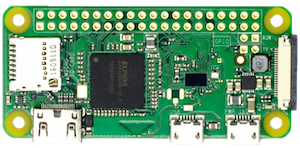

# Setting up a Raspberry Pi (Mac)
Instructions on how to setup a Raspberry Pi without dedicated keyboard, mouse or monitor using a Mac. We'll be using the command line which can be useful if you'd want to automate the process and tie it all together in a script.

**Warning:** Using the command line can be risky if not familiar with using it. In particular when it comes to reading and writing the disk where a mistake can lead to corrupting or erasing your OS.

## Get the latest Raspbian Image
Download and inflate the ZIP file. The URL use is the one for Raspbian Stretch with PIXEL to get Raspbian Stretch Lite instead use: `https://downloads.raspberrypi.org/raspbian_lite_latest`
```bash
$ curl -L -o raspbian.zip https://downloads.raspberrypi.org/raspbian_latest
$ unzip raspbian.zip
```

## Prepare SD Card
Insert your Micro SD card, format it and write the image to the card.

Find identifier of the SD card disk, in this example it's `disk3` (not the partition `disk3s1`)
```bash
$ diskutil list physical
/dev/disk0 (internal, physical):
   #:                       TYPE NAME                    SIZE       IDENTIFIER
   0:      GUID_partition_scheme                        *751.3 GB   disk0
   1:                        EFI EFI                     209.7 MB   disk0s1
   2:          Apple_CoreStorage Macintosh HD            750.4 GB   disk0s2
   3:                 Apple_Boot Recovery HD             650.0 MB   disk0s3

/dev/disk3 (internal, physical):
   #:                       TYPE NAME                    SIZE       IDENTIFIER
   0:     FDisk_partition_scheme                        *15.9 GB    disk3
   1:                 DOS_FAT_32 RASPBIAN                15.9 GB    disk3s1
```
Write disk image to SD card (use disk number identified in the list above, note `disk` vs. `rdisk` in the commands)
```bash
$ diskutil unmountDisk /dev/disk3
$ sudo dd bs=1m if=`ls *-raspbian-stretch.img` of=/dev/rdisk3
$ touch /Volumes/boot/ssh
```
The last step is to enable ssh on the Raspberry Pi in order to be able to remotely access it through the network.

### Raspberry Pi Zero W Only
Since the Raspberry Pi Zero W doesn't have an ethernet port a connection must be made through the USB port. For that a couple more files must be touched.
```bash
$ echo "dtoverlay=dwc2" >> /Volumes/boot/config.txt
$ sed -i -e "s/\(rootwait\)/\1 modules-load=dwc2,g_ether/" /Volumes/boot/cmdline.txt
```
Instead of hooking it up to the ethernet, the Raspberry Pi Zero W will connect to a USB port of the Mac.

To establish a network connection over USB, your Raspberry Pi Zero W will have to be connected using the USB port and can't be confused with the power port. Both use the Micro USB standard but only the one on the left (closer to the HDMI port) can be used for data as well as powering the Pi.



## Final Steps
Take the SD card and insert it into the Raspberry Pi, connect the Pi to the network via ethernet and connect it to the power to boot it up.

Log into the Raspberry from the Mac.
```bash
$ ssh pi@raspberrypi.local
$ sudo raspi-config
```
The default password is `raspberry`. Changing the default password should be the first configuration change. 

# References
* [www.raspberrypi.org/documentation/installation/installing-images/mac.md](https://www.raspberrypi.org/documentation/installation/installing-images/mac.md)
* [www.raspberrypi.org/documentation/remote-access/ssh/](https://www.raspberrypi.org/documentation/remote-access/ssh/)
* [caffinc.github.io/2016/12/raspberry-pi-3-headless/](https://caffinc.github.io/2016/12/raspberry-pi-3-headless/)
* [www.thepolyglotdeveloper.com/2016/06/connect-raspberry-pi-zero-usb-cable-ssh/](https://www.thepolyglotdeveloper.com/2016/06/connect-raspberry-pi-zero-usb-cable-ssh/)
